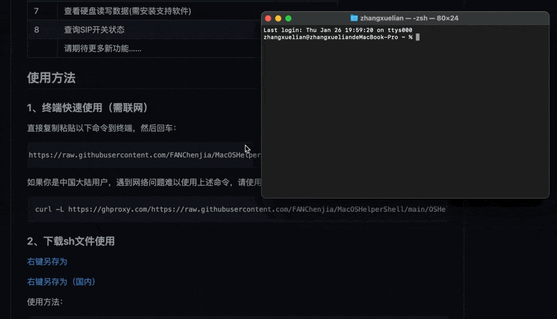
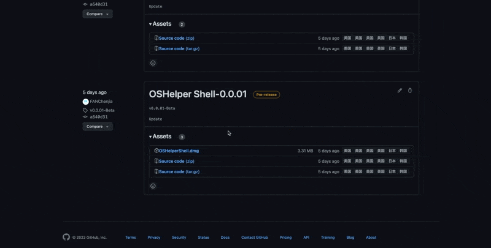

<h4 align="right"><strong>中文</strong> | <a href="https://github.com/FANChenjia/MacOSHelperShell/blob/main/README_EN.md">English</a></h4>
<p align="center">
    
</p>
<h1 align="center">MacOSHelperShell</h1>
<div align="center">   
  
   
  <a href="https://github.com/FANChenjia/MacOSHelperShell/releases" target="_blank">
    </a>
</div>


一款简单易用的macOS帮助脚本，可以便捷的实现一些功能。

该脚本由[明燊](https://github.com/FANChenjia)、[小叶](https://github.com/yeenjie123456)、[Jerry](https://github.com/Jerry-XU1010)共同开发和维护，非常好用，具体怎么好用你用了就知道了。

---

## 功能

| 序号 | 功能                                                       | 备注 |
| ---- | ---------------------------------------------------------- | ---- |
| 1    | 开启"全部来源"                                             |      |
| 2    | 移除隔离属性(解决"已损坏问题")                             |      |
| 3    | 将Dock重置为默认                                           |      |
| 4    | 清除缩略图缓存(适用于缩略图被抢)                           |      |
| 5    | 安装Xcode CLT(因国内网络问题,可能等待时间较长或安装失败)   |      |
| 6    | 安装Homebrew(耗时可能有点长,请耐心等待,已经装过就不用装了) |      |
| 7    | 查看硬盘读写数据(需安装支持软件)                           |      |
| 8    | 查询SIP开关状态                                            |      |
| 9    | MD5校验                                                    |      |
|      | 请期待更多新功能……                                         |      |


## 使用方法

### 1、终端快速使用（需联网）

直接复制粘贴以下命令到终端，然后回车：

```shell
curl -L https://raw.githubusercontent.com/FANChenjia/MacOSHelperShell/main/OSHelper.sh -O && sh OSHelper.sh
```

如果你是中国大陆用户，遇到网络问题难以使用上述命令，请使用下面的命令：

```shell
curl -L https://ghproxy.com/https://raw.githubusercontent.com/FANChenjia/MacOSHelperShell/main/OSHelper.sh -O && sh OSHelper.sh
```

🚀优点：无需手动下载文件，每次使用都保证是最新版。

示例：



### 2、下载sh文件使用

[右键另存为](https://raw.githubusercontent.com/FANChenjia/MacOSHelperShell/main/OSHelper.sh)

[右键另存为（国内）](https://ghproxy.com/https://raw.githubusercontent.com/FANChenjia/MacOSHelperShell/main/OSHelper.sh)

使用方法：

```shell
sh /PATH（你的实际文件路径）/OSHelper.sh
```

也可以直接先在终端输入sh，然后打个空格，然后把你下载的文件拖进终端窗口。

示例：

🚀优点：离线使用，版本手动更新。

### 3、下载release中的dmg使用

[点我进入release](https://github.com/FANChenjia/MacOSHelperShell/releases)

示例：

🚀优点：使用方便。

待完善……
